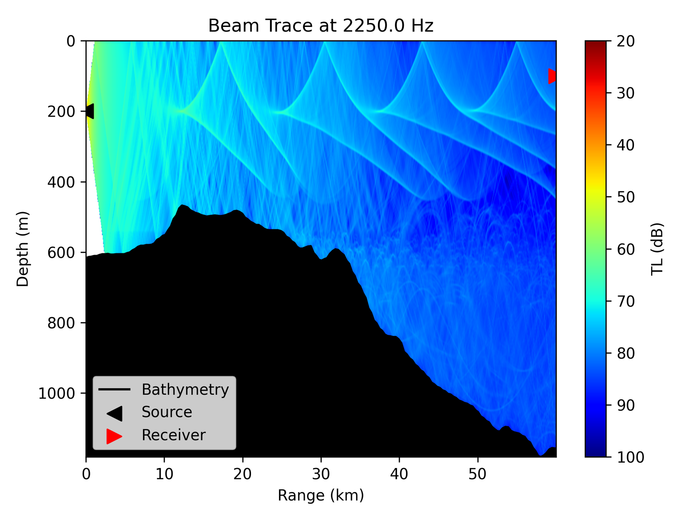

# Underwater Acoustic Time Series Simulation using Fourier Synthesis

This is an infographic about using fourier synthesis to produce accurate time series from efficient fixed frequency modelling.

Infographic: https://fincb.github.io/fsinfo/fsinfo.html

Some Pretty Pictures:

  

<i>Figure 1: Received time series from a hanning pulse in a pekeris waveguide using the kraken normal mode program.</i>

  

<i>Figure 2: Fixed frequency propagation in a realistic range dependent ocean waveguide using the bellhop ray tracing mode, GEBCO bathymetry, and Copernicus sound speed profiles.</i>

